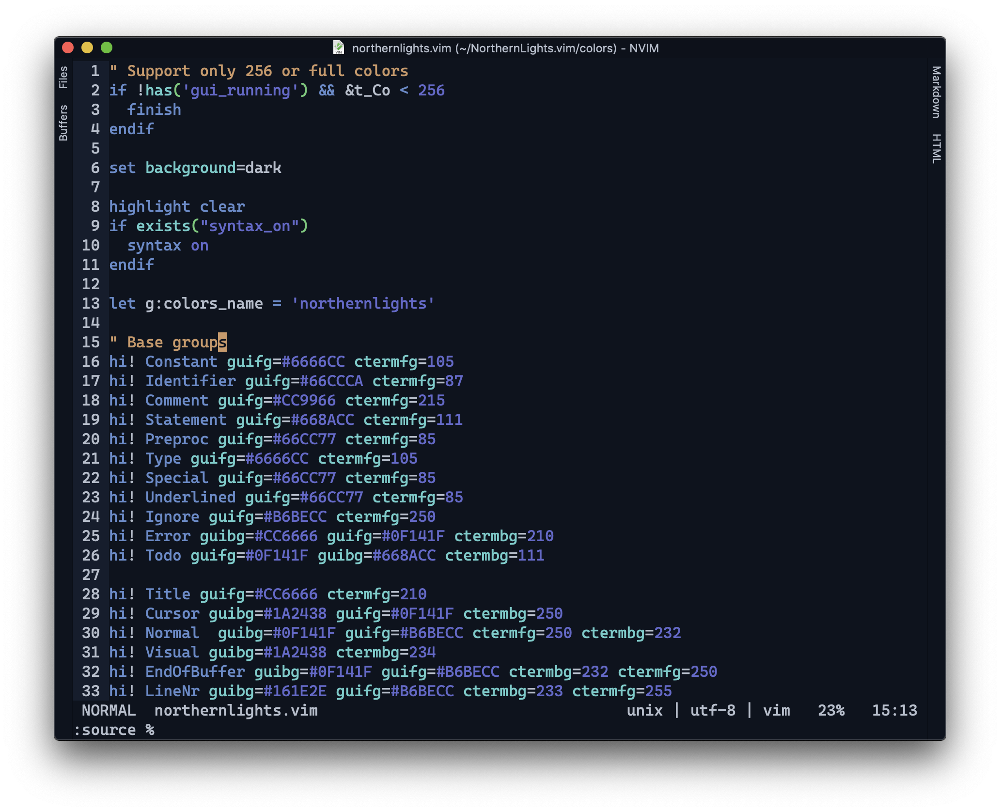
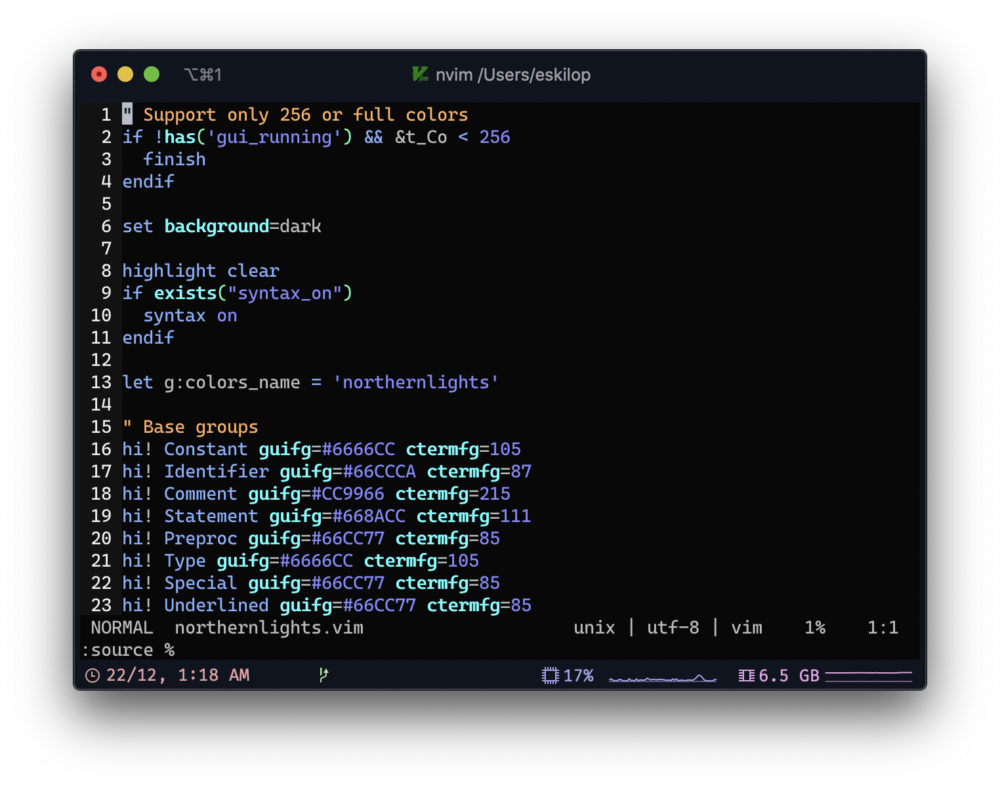

# NorthernLights for Vim
My NorthernLights theme for Vim

At the moment, this theme, doesn't support any plugin, it's just a colorscheme.

## Screenshots
GUI mode and Terminal mode




## Installation
Use your plugin manager.
For Vundle:

```
Plugin 'NorthernLightsTheme/NorthernLightsVim'
```

For vim-plug:

```
Plug 'NorthernLightsTheme/NorthernLightsVim'
```

then set the colorscheme:

```
colorscheme northernlights
```
